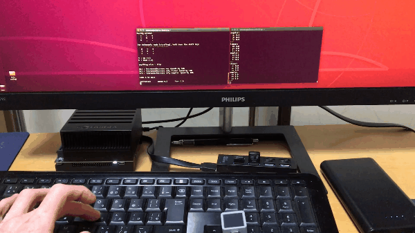
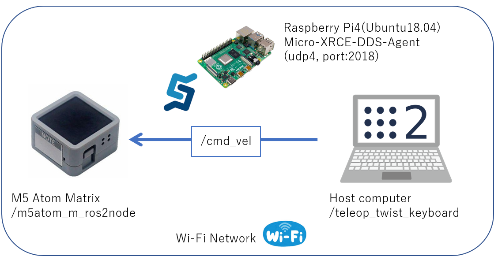
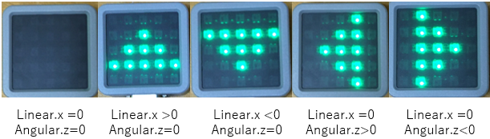

# M5Atom_Matrix_Sub_Twist

## Description

- M5 Stack Atom Matrix receives Twsit messages and changes the display.

## Requirement

- M5 Stack Atom Matrix(Subscriber)
- Computers that can send "geometry_msgs/Twist" with controller or keyboard.(Publisher)
- Micro-XRCE-DDS-Agent(HOST)
- ROS2 dashing & ros2arduino

## System block

- All computer or microcontroller connect to Wi-Fi network(LAN).
- M5 Stack Atom Matrix connects to Raspberry Pi4 by Micro-XRCE-DDS-Agent.
- The host computer publishes "/cmd_vel" of type "geometry_msgs/Twist".
- M5 Stack Atom Matrix subscribes "/cmd_vel".

It changes the icon to display depending on the direction.

## Customize

- You have to change the following strings to make the program work...
  - String ssid : Wi-Fi router's SSID
  - String pass : Wi-Fi router's Password
  - String agent_ip : IP address for Micro-XRCE-DDS-Agent.(e.g. Raspberry Pi4's IP4 address)

## License

Apache License 2.0 : https://github.com/Ar-Ray-code/M5Atom_Matrix_Sub_Twist/blob/main/LICENSE